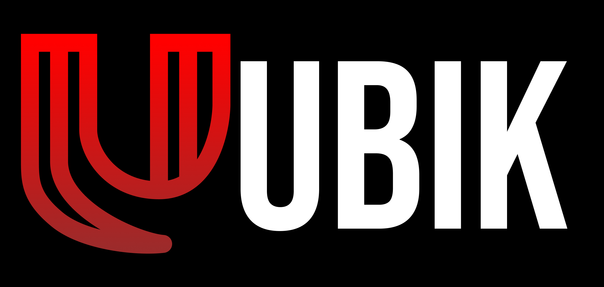

# 🏨 Ubik - Plataforma de Gestión y Reservas de Moteles

<p align="center">
  
</p>

<p align="center">
  <a href="#">
    
  </a>
  <a href="#">
    
  </a>
  <a href="#">
    
  </a>
</p>

---

## 📌 Descripción del Proyecto

**Ubik** es un aplicativo web diseñada específicamente para el sector hotelero turístico, desarrollada con Angular. La aplicación facilita la búsqueda de moteles y la realización de reservas de manera fácil y segura, conectando a dos tipos de usuarios principales:

- 🏢 **Dueños de moteles**: Pueden registrarse, agregar sus establecimientos, gestionar habitaciones y ofertas.
- 👤 **Clientes**: Pueden explorar moteles cercanos, visualizar disponibilidad y realizar reservas de forma intuitiva.

---

## 🎯 Objetivos del Proyecto

1. **Digitalización del sector motelero** proporcionando una plataforma moderna de reservas en línea.
2. **Facilitar la gestión** a los propietarios de moteles con herramientas intuitivas para administrar sus establecimientos.
3. **Mejorar la experiencia del usuario** final ofreciendo una forma simple y segura de encontrar y reservar habitaciones.
4. **Soporte multi-rol** permitiendo diferentes niveles de acceso según el tipo de usuario.

---

## ✨ Características Principales

### Para Propietarios de Moteles

- ✅ Registro y autenticación segura de propietarios
- ✅ Gestión de múltiples establecimientos moteleros
- ✅ Administración de habitaciones por motel
- ✅ Configuración de servicios y amenidades por habitación
- ✅ Panel de visualización de reservas realizadas por clientes
- ✅ Gestión de ofertas y promociones

### Para Clientes

- ✅ Exploración de moteles por ubicación
- ✅ Búsqueda de habitaciones disponibles
- ✅ Sistema de reservas en línea
- ✅ Visualización de servicios y amenidades disponibles
- ✅ Integración con mapas para localizar moteles cercanos

### Funcionalidades del Sistema

- 🔐 **Autenticación y Autorización** con soporte multi-rol (propietario, cliente)
- 📍 **Geolocalización** para mostrar ubicación del usuario en tiempo real
- 🗺️ **Mapas Interactivos** para explorar moteles cercanos
- 📱 **Diseño Mobile-First** adaptado para dispositivos móviles
- 💳 **Sistema de Pagos** integrado para reservas seguras

---

## 🏗️ Arquitectura del Proyecto

El proyecto sigue una arquitectura modular basada en **Angular**, organizando el código en:

```
src/
├── app/
│   ├── components/          # Componentes reutilizables
│   │   ├── button-01/      # Botones estilizados
│   │   ├── card/            # Tarjetas de contenido
│   │   ├── card-motel/      # Tarjetas de moteles
│   │   ├── card-room/       # Tarjetas de habitaciones
│   │   ├── card-offers/     # Tarjetas de ofertas
│   │   ├── filter-modal/    # Modal de filtros
│   │   ├── map/             # Componente de mapas
│   │   ├── payment-modal/   # Modal de pagos
│   │   └── ...
│   │
│   ├── core/               # Núcleo de la aplicación
│   │   ├── guards/         # Guards de autenticación
│   │   ├── interceptors/    # Interceptores HTTP
│   │   ├── models/         # Modelos de datos
│   │   │   ├── motel.model.ts
│   │   │   ├── room.model.ts
│   │   │   ├── reservation.model.ts
│   │   │   ├── users.model.ts
│   │   │   └── ...
│   │   ├── services/       # Servicios de negocio
│   │   │   ├── auth.service.ts
│   │   │   ├── motel.service.ts
│   │   │   ├── room.service.ts
│   │   │   ├── reservation.service.ts
│   │   │   └── ...
│   │   └── utils/          # Utilidades
│   │
│   ├── layout/             # Componentes de diseño
│   │   ├── header/         # Encabezado
│   │   ├── footer/         # Pie de página
│   │   └── nav-bar-bottom/ # Navegación móvil
│   │
│   └── views/              # Vistas de la aplicación
│       ├── dashboard/      # Paneles (admin, owner)
│       ├── explore/        # Exploración de moteles
│       ├── home/           # Página principal
│       ├── motel-profile/  # Perfil del motel
│       ├── rooms-motel/    # Habitaciones del motel
│       ├── product-room/   # Detalle de habitación
│       ├── user-profile/   # Perfil de usuario
│       └── Forms/          # Formularios (login, register, etc.)
│
├── environments/           # Configuraciones de entorno
└── styles.css              # Estilos globales
```

---

## 🛠️ Tecnologías Utilizadas

| Tecnología         | Descripción                        |
| ------------------ | ---------------------------------- |
| **Angular 17+**    | Framework frontend principal       |
| **TypeScript**     | Lenguaje de programación tipado    |
| **Tailwind CSS**   | Framework de estilos utility-first |
| **Leaflet**        | Biblioteca para mapas interactivos |
| **RxJS**           | Programación reactiva              |
| **Angular Router** | Sistema de navegación              |
| **Angular Forms**  | Manejo de formularios reactivos    |

---

## 🚀 Cómo Ejecutar el Proyecto

### Prerrequisitos

- Node.js (v18+)
- npm o pnpm
- Angular CLI (`npm install -g @angular/cli`)

### Pasos de Instalación

1. **Clonar el repositorio**

   ```bash
   git clone https://github.com/Juankos0714/Ubik-App.git
   ```

2. **Navegar al directorio del proyecto**

   ```bash
   cd Ubik-App
   ```

3. **Instalar dependencias**

   ```bash
   npm install
   # o si usas pnpm
   pnpm install
   ```

4. **Ejecutar la aplicación en modo desarrollo**

   ```bash
   ng serve
   # o con npm
   npm start
   ```

5. **Abrir en el navegador**
   ```
   http://localhost:4200
   ```

### Comandos Útiles

| Comando                        | Descripción                             |
| ------------------------------ | --------------------------------------- |
| `ng serve`                     | Inicia el servidor de desarrollo        |
| `ng build`                     | Construye la aplicación para producción |
| `ng test`                      | Ejecuta las pruebas unitarias           |
| `ng generate component <name>` | Genera un nuevo componente              |

---

## 📱 Diseño Mobile-First

La interfaz de **Ubik** está diseñada pensando primero en dispositivos móviles, ofreciendo una experiencia de usuario óptima en pantallas pequeñas y adaptándose fluidamente a dispositivos de escritorio.

---

## 📄 Licencia

Este proyecto está bajo la licencia **MIT**. Consulta el archivo `LICENSE` para más detalles.

---

## 👥 Contribuidores

- [**Juan Camilo Rojas Ospina**](https://github.com/Juankos0714)

- [**Miguel Angel Vargas Navarro**](https://github.com/Miguel-A-VN)

- [**Julian Gordillo**](https://github.com/Juliango2494)

- [**Nicolas Londoño Diaz**](https://github.com/Nicolasld222)


---

<p align="center">
  <sub>Proyecto Formativo SENA 2024 - 2026 ❤️</sub>
</p>
